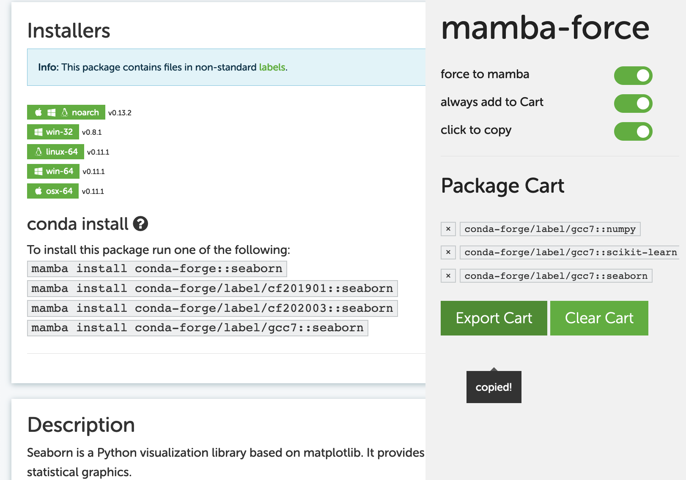

# mamba-force

> **mamba-force** is web browser extensions running on [anaconda.org](https://anaconda.org/) for *Mamba* users.
- Replaces the install command for the *Mamba* on anaconda.org.
- Put the packages in the cart and copy them all at **once**.
- Cart are shared between all tabs in the same browser.
- Tested on the Chromium/Firefox browser.

## Preview

And then, `mamba install conda-forge/label/gcc7::numpy conda-forge/label/gcc7::scikit-learn conda-forge/label/gcc7::seaborn` will be written on the clipboard.

## Installation

### Chromium (like Google Chrome, Edge, Brave...)
1. Download this project and decompress it.
2. Visit [chrome://extensions](chrome://extensions)
3. Allow Developer Mode.
4. Click "Load unpacked".
5. Select src folder for this project.

### Firefox
-  Visit this [Firefox Add-On](https://addons.mozilla.org/en-US/firefox/addon/mamba-force/) page.
